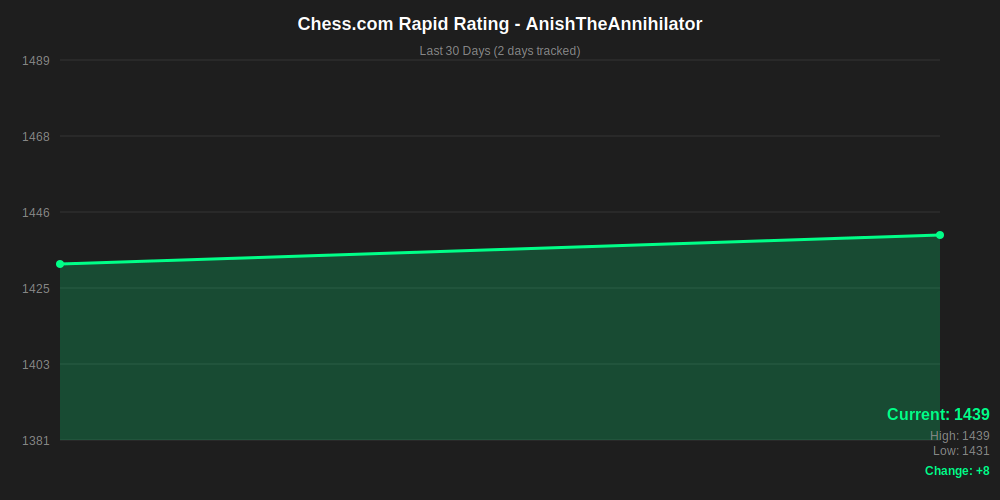

<h1 align="center">
    
</h1>
<h3 align="center">Finance Systems Analyst | Purdue Stats Grad | AI/ML Projects</h3>
 

   

  
# 🎃Python/Pandas October🎃 
🌱 Expanding trade_sim (quant dev)  
🧠 Mastering C++(20) and Python  
🎮 Hobbies include video games, badminton, and chess  
 

  

 
  
  

 

<h2 align="center">⚒️ Languages/Tools ⚒️</h2>
 

      
    
     

<!--
<h2 align="center">⚡ Stats ⚡</h2>
 

  

  
--!>

<picture>
  <source media="(prefers-color-scheme: dark)" srcset="https://raw.githubusercontent.com/Anish1337/Anish1337/output/github-snake-dark.svg" />
  <source media="(prefers-color-scheme: light)" srcset="https://raw.githubusercontent.com/Anish1337/Anish1337/output/github-snake.svg" />
  
</picture>  

<!-- Fix this later

--!>
